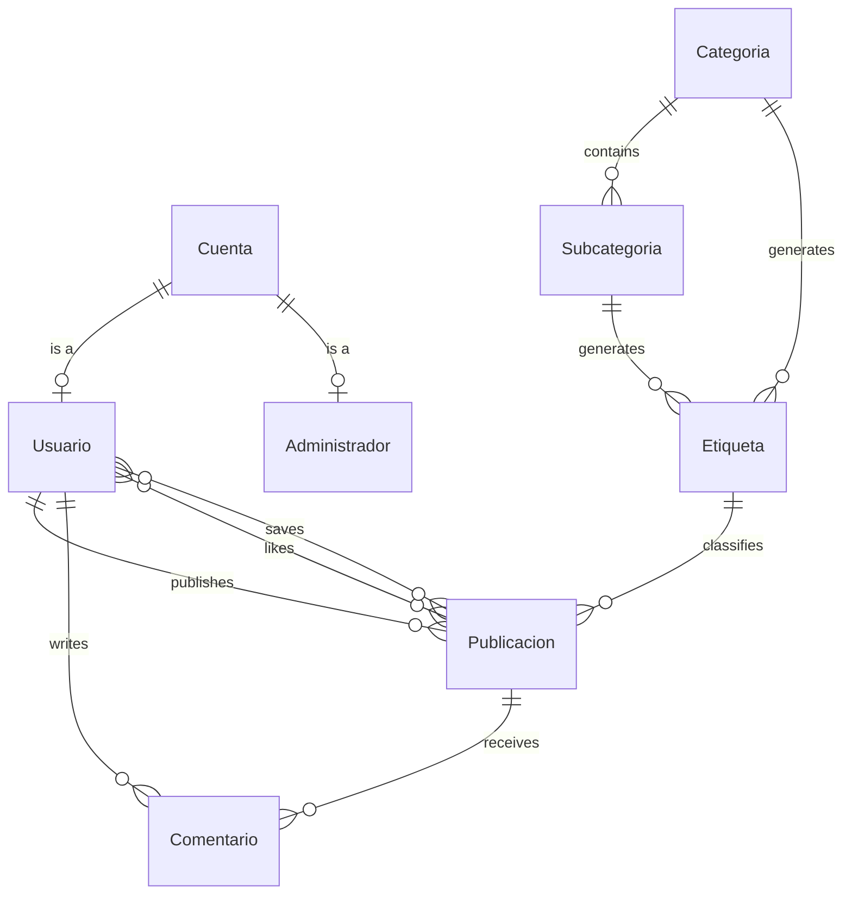

# ArtCenter API

REST API powering **ArtCenter**, an Android app about art disciplines that combines educational content organised into categories and subcategories with a social feed where users share their own work.

This repository holds the backend only. The Android app lives at **[emermelada/ArtCenter](https://github.com/emermelada/ArtCenter)**.

Final project for the Higher Vocational Degree in Cross-Platform Application Development (U-tad, June 2025).

---

## Stack

| Component | Technology |
|---|---|
| Language | Python 3.11 |
| Framework | Flask 3.1 (blueprints) |
| Database | MySQL 8.0, accessed with PyMySQL and hand-written SQL |
| Authentication | JWT (PyJWT, HS256) with a custom decorator |
| Passwords | Hashed with Werkzeug (`pbkdf2:sha256`) |
| Image storage | Cloudinary |
| Documentation | OpenAPI 3 served through Swagger UI at `/api/documentacion` |

No ORM is used: every query is SQL written by hand on top of PyMySQL.

---

## Features

**Authentication and roles.** Sign-up and login on a unique email. Login resolves the role by checking whether the account exists in the `Administrador` table, and that role travels inside the token. Every endpoint except register and login requires `Authorization: Bearer <token>`.

- **Administrators** manage the educational content: create, edit and delete categories and subcategories. They can also delete any post or comment.
- **Users** publish work, comment, like and save. An administrator cannot publish (the API returns 403): the role is about curation, not participation in the feed.

**Paginated feed.** Listings of 20 items via `LIMIT`/`OFFSET`, with a zero-based `page` parameter. Applies to the main feed, own posts, saved posts and search.

**Posts.** The image is uploaded to Cloudinary and only the resulting URL is stored. Each post can carry a tag linking it to a category or subcategory.

**Tags.** They generate themselves: two MySQL triggers create the matching tag whenever a category or subcategory is inserted, so the tag catalogue can never drift out of sync with the content.

**Likes and saves.** Both behave as a switch on the same endpoint: the first call adds, the second removes. The `likes` counter on each post is maintained by two database triggers.

**Comments.** Listing and creation per post. Users can delete their own; administrators can delete any.

**Search.** A single free-text term matched against the category name, the subcategory name, the post description, the author's username and their email.

---

## Endpoints

Every route is mounted under `/api`. The *Access* column states what is required beyond a valid token.

### Authentication

| Method | Route | Access | Description |
|---|---|---|---|
| `POST` | `/api/auth/register` | Public | Creates account and user. Body: `email`, `contrasena`, `username` |
| `POST` | `/api/auth/login` | Public | Returns the JWT and the role |

### User

| Method | Route | Access | Description |
|---|---|---|---|
| `GET` | `/api/user` | Token | Authenticated user's details |
| `PUT` | `/api/user/username` | Token | Changes the username |
| `PUT` | `/api/user/profile-picture` | Token | Uploads the profile picture to Cloudinary (`multipart/form-data`) |

### Categories

| Method | Route | Access | Description |
|---|---|---|---|
| `GET` | `/api/categorias` | Token | List categories |
| `GET` | `/api/categorias/{id}` | Token | Category detail |
| `POST` | `/api/categorias` | Admin | Create category. Body: `nombre`, `descripcion` |
| `PUT` | `/api/categorias/{id}` | Admin | Edit category |
| `DELETE` | `/api/categorias/{id}` | Admin | Delete category |

### Subcategories

| Method | Route | Access | Description |
|---|---|---|---|
| `GET` | `/api/subcategorias` | Token | Full listing |
| `GET` | `/api/subcategorias/categoria/{id_categoria}` | Token | Subcategories of a category |
| `GET` | `/api/subcategorias/{id_categoria}/{id_subcategoria}` | Token | Detail: history, characteristics, requirements and tutorials |
| `POST` | `/api/subcategorias` | Admin | Create subcategory |
| `PUT` | `/api/subcategorias/{id_categoria}/{id_subcategoria}` | Admin | Edit subcategory |
| `DELETE` | `/api/subcategorias/{id_categoria}/{id_subcategoria}` | Admin | Delete subcategory |

### Tags

| Method | Route | Access | Description |
|---|---|---|---|
| `GET` | `/api/etiquetas` | Token | List available tags |

### Posts

| Method | Route | Access | Description |
|---|---|---|---|
| `GET` | `/api/publicaciones?page=0` | Token | Paginated feed, 20 per page |
| `GET` | `/api/publicaciones/mias?page=0` | Token | Own posts |
| `GET` | `/api/publicaciones/guardadas?page=0` | Token | Saved posts |
| `GET` | `/api/publicaciones/buscar?q=&page=0` | Token | Free-text search |
| `GET` | `/api/publicaciones/{id}` | Token | Detail with likes and the caller's state |
| `POST` | `/api/publicaciones` | Token (non-admin) | Create post. `multipart/form-data`: `file`, `descripcion`, `id_etiqueta` |
| `POST` | `/api/publicaciones/{id}/like` | Token | Toggles the like |
| `POST` | `/api/publicaciones/{id}/guardar` | Token | Toggles the save |
| `DELETE` | `/api/publicaciones/{id}` | Author or admin | Delete post |

### Comments

| Method | Route | Access | Description |
|---|---|---|---|
| `GET` | `/api/publicaciones/{id_publicacion}/comentarios` | Token | Comments on a post |
| `POST` | `/api/publicaciones/{id_publicacion}/comentarios` | Token | Create comment. Body: `contenido` |
| `DELETE` | `/api/comentarios/{id_comentario}` | Author or admin | Delete comment |

OpenAPI documentation for the main endpoints is available at `/api/documentacion` once the app is running.

Route paths, request fields and database identifiers are in Spanish, matching the Android client that consumes this API.

---

## Data model



`Cuenta` holds the credentials (unique email and password hash) and is the root of the hierarchy. `Usuario` and `Administrador` share its primary key through a foreign key: the role is not a column, it is whichever table the record lives in.

`Categoria` groups art disciplines and breaks down into `Subcategoria`, which uses a composite primary key (`id_categoria`, `id_subcategoria`) and stores the educational content: history, characteristics, requirements and tutorials.

`Etiqueta` is the piece connecting the educational side to the social one. It hangs off a category and optionally a subcategory, and is created automatically by a trigger whenever either is inserted. A tagged post is therefore tied to its corresponding educational content.

`Publicacion` stores the Cloudinary image URL, the description, the tag and a denormalised like counter kept up to date by triggers. `Comentario` hangs off a post and a user.

Many-to-many relationships live in their own tables: `Usuario_Da_Like` and `Usuario_Guarda_Publicacion` for feed interaction, plus `Usuario_Guarda_Categoria` and `Usuario_Guarda_Subcategoria`, which the design anticipated for bookmarking educational content but which have no endpoints in this version.

The full schema, with `CHECK` constraints, foreign keys and triggers, is in [`ScriptArtCenterDB.sql`](ScriptArtCenterDB.sql).

---

## Getting started

### Requirements

- Python 3.11
- MySQL 8.0
- A Cloudinary account

### 1. Clone and install dependencies

```bash
git clone https://github.com/emermelada/artcenter_api.git
cd artcenter_api

python -m venv venv
venv\Scripts\activate        # On Linux/macOS: source venv/bin/activate

pip install -r requirements.txt
```

### 2. Create the database

```bash
mysql -u root -p < ScriptArtCenterDB.sql
```

The script creates the `artcenterDB` database, every table and the four triggers.

### 3. Set the environment variables

Copy `.env.example` to `.env` and fill in the values:

```
SECRET_KEY=
JWT_SECRET_KEY=

MYSQL_HOST=
MYSQL_USER=
MYSQL_PASSWORD=
MYSQL_DB=

CLOUDINARY_CLOUD_NAME=
CLOUDINARY_API_KEY=
CLOUDINARY_API_SECRET=
```

The three Cloudinary credentials are in your account dashboard. `config.py` reads them and configures the SDK at startup.

`.env` is excluded from version control and must never be committed.

### 4. Run the server

```bash
python app.py
```

On Windows `run.bat` also works: it activates the virtual environment and runs `flask run`.

The API listens on `http://localhost:5000` and the Swagger docs are at **`http://localhost:5000/api/documentacion`**.

### 5. Create an administrator

There is no sign-up endpoint for administrators; they are inserted by hand. Generate the password hash with `routes/admin.py`, insert the row into `Cuenta` and add its `id` to the `Administrador` table.

---

## Technical decisions

**The backend started on AWS and ended up on Flask.** The original plan was API Gateway with Lambda functions and the database on RDS. Once it reached testing the integration never quite worked, and keeping it alive was costing more time than the project had. Rebuilding it as a monolithic Flask API was the right call for the actual scope: a backend that a single developer has to be able to run, debug and change alongside the Android app.

**JWT instead of server-side sessions.** The client is an Android app, not a browser: there are no cookies or session state to lean on. A signed token the app stores and sends with every request fits better and keeps the API stateless. Putting the role inside the token also avoids a database round trip on every request just to find out whether the caller is an administrator.

**Cloudinary rather than files on disk.** This was not in the original design. It came up during development, when I realised I had nowhere to put the images users uploaded. Keeping them on the server filesystem meant solving serving, backups and disk growth myself, and tied the API to one specific machine. Cloudinary returns a URL on upload, so the database stores nothing but that string: the API stops handling binaries and the Android app loads images straight from a CDN.

**Feed pagination and per-user state in a single query.** The feed loads 20 posts at a time with `LIMIT`/`OFFSET` as the user scrolls. The part I learned the most from was avoiding the obvious trap: every post needs to know whether the current viewer has liked it and whether they have saved it, and checking that post by post is 40 extra queries per page. The fix is two `LEFT JOIN`s against the relationship tables, already filtered by the user id from the token, then testing whether the resulting row is null. One query returns the whole page with its `liked` and `saved` flags.

**Counters and tags are the database's job.** The like count and the creation of tags when categories and subcategories are added are handled by triggers. That is logic which cannot be left half-applied or depend on some route remembering to run it.

---

## Project status

Working locally and in use by the Android app. **Deployment is pending**: the plan is to self-host it behind Gunicorn and Nginx on my own Arch Linux server rather than going back to a managed provider.

Left out of this version are advanced search filters and bookmarking of categories and subcategories, both part of the design and already supported by the database schema.

---

## License

[MIT](LICENSE). Free to use.
