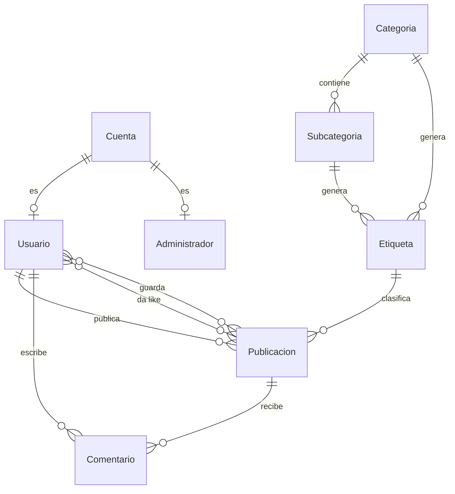

# ArtCenter API

API REST que da servicio a **ArtCenter**, una aplicación Android sobre disciplinas artísticas que combina contenido educativo organizado por categorías y subcategorías con una red social donde los usuarios comparten sus obras.

Este repositorio contiene únicamente el backend. La aplicación Android está en **[emermelada/ArtCenter](https://github.com/emermelada/ArtCenter)**.

Proyecto de fin de ciclo del Grado Superior de Desarrollo de Aplicaciones Multiplataforma (U-tad, convocatoria de junio de 2025).

---

## Stack

| Componente | Tecnología |
|---|---|
| Lenguaje | Python 3.11 |
| Framework | Flask 3.1 (blueprints) |
| Base de datos | MySQL 8.0, acceso con PyMySQL y SQL directo |
| Autenticación | JWT (PyJWT, HS256) con decorador propio |
| Contraseñas | Hash con Werkzeug (`pbkdf2:sha256`) |
| Almacenamiento de imágenes | Cloudinary |
| Documentación | OpenAPI 3 servida con Swagger UI en `/api/documentacion` |

No se usa ORM: las consultas son SQL escrito a mano sobre PyMySQL.

---

## Funcionalidades

**Autenticación y roles.** Registro y login sobre email único. El login determina el rol consultando si la cuenta existe en la tabla `Administrador`, y ese rol viaja dentro del token. Todos los endpoints salvo registro y login exigen `Authorization: Bearer <token>`.

- Los **administradores** gestionan el contenido educativo: crear, editar y eliminar categorías y subcategorías. También pueden eliminar cualquier publicación o comentario.
- Los **usuarios** publican obra, comentan, dan like y guardan. Un administrador no puede publicar (la API responde 403): su rol es de gestión, no de participación en el feed.

**Feed paginado.** Listados de 20 en 20 mediante `LIMIT`/`OFFSET`, con `page` en base 0. Aplica al feed general, a las publicaciones propias, a las guardadas y a la búsqueda.

**Publicaciones.** Subida de imagen a Cloudinary y persistencia de la URL resultante. Cada publicación puede llevar una etiqueta asociada que la vincula a una categoría o subcategoría.

**Etiquetas.** Se generan solas: dos triggers de MySQL crean la etiqueta correspondiente al insertar una categoría o una subcategoría, de forma que el catálogo de etiquetas nunca se desincroniza del de contenidos.

**Likes y guardados.** Ambos funcionan como interruptor sobre el mismo endpoint: la primera llamada añade, la segunda retira. El contador `likes` de cada publicación lo mantienen dos triggers en la base de datos.

**Comentarios.** Listado y creación por publicación. Cada usuario puede borrar los suyos; un administrador puede borrar cualquiera.

**Búsqueda.** Un único término libre que se compara contra el nombre de la categoría, el de la subcategoría, la descripción de la publicación, el nombre de usuario y el email del autor.

---

## Endpoints

Todas las rutas cuelgan de `/api`. La columna *Acceso* indica qué hace falta además de un token válido.

### Autenticación

| Método | Ruta | Acceso | Descripción |
|---|---|---|---|
| `POST` | `/api/auth/register` | Público | Crea cuenta y usuario. Body: `email`, `contrasena`, `username` |
| `POST` | `/api/auth/login` | Público | Devuelve el JWT y el rol |

### Usuario

| Método | Ruta | Acceso | Descripción |
|---|---|---|---|
| `GET` | `/api/user` | Token | Datos del usuario autenticado |
| `PUT` | `/api/user/username` | Token | Cambia el nombre de usuario |
| `PUT` | `/api/user/profile-picture` | Token | Sube la foto de perfil a Cloudinary (`multipart/form-data`) |

### Categorías

| Método | Ruta | Acceso | Descripción |
|---|---|---|---|
| `GET` | `/api/categorias` | Token | Listado de categorías |
| `GET` | `/api/categorias/{id}` | Token | Detalle de una categoría |
| `POST` | `/api/categorias` | Admin | Crea categoría. Body: `nombre`, `descripcion` |
| `PUT` | `/api/categorias/{id}` | Admin | Edita categoría |
| `DELETE` | `/api/categorias/{id}` | Admin | Elimina categoría |

### Subcategorías

| Método | Ruta | Acceso | Descripción |
|---|---|---|---|
| `GET` | `/api/subcategorias` | Token | Listado completo |
| `GET` | `/api/subcategorias/categoria/{id_categoria}` | Token | Subcategorías de una categoría |
| `GET` | `/api/subcategorias/{id_categoria}/{id_subcategoria}` | Token | Detalle: historia, características, requerimientos y tutoriales |
| `POST` | `/api/subcategorias` | Admin | Crea subcategoría |
| `PUT` | `/api/subcategorias/{id_categoria}/{id_subcategoria}` | Admin | Edita subcategoría |
| `DELETE` | `/api/subcategorias/{id_categoria}/{id_subcategoria}` | Admin | Elimina subcategoría |

### Etiquetas

| Método | Ruta | Acceso | Descripción |
|---|---|---|---|
| `GET` | `/api/etiquetas` | Token | Listado de etiquetas disponibles |

### Publicaciones

| Método | Ruta | Acceso | Descripción |
|---|---|---|---|
| `GET` | `/api/publicaciones?page=0` | Token | Feed paginado, 20 por página |
| `GET` | `/api/publicaciones/mias?page=0` | Token | Publicaciones propias |
| `GET` | `/api/publicaciones/guardadas?page=0` | Token | Publicaciones guardadas |
| `GET` | `/api/publicaciones/buscar?q=&page=0` | Token | Búsqueda por término libre |
| `GET` | `/api/publicaciones/{id}` | Token | Detalle con likes y estado del usuario |
| `POST` | `/api/publicaciones` | Token (no admin) | Crea publicación. `multipart/form-data`: `file`, `descripcion`, `id_etiqueta` |
| `POST` | `/api/publicaciones/{id}/like` | Token | Alterna el like |
| `POST` | `/api/publicaciones/{id}/guardar` | Token | Alterna el guardado |
| `DELETE` | `/api/publicaciones/{id}` | Autor o admin | Elimina publicación |

### Comentarios

| Método | Ruta | Acceso | Descripción |
|---|---|---|---|
| `GET` | `/api/publicaciones/{id_publicacion}/comentarios` | Token | Comentarios de una publicación |
| `POST` | `/api/publicaciones/{id_publicacion}/comentarios` | Token | Crea comentario. Body: `contenido` |
| `DELETE` | `/api/comentarios/{id_comentario}` | Autor o admin | Elimina comentario |

La documentación OpenAPI de los principales endpoints está disponible en `/api/documentacion` con la aplicación levantada.

---

## Modelo de datos



`Cuenta` guarda las credenciales (email único y hash de contraseña) y es la raíz de la jerarquía. `Usuario` y `Administrador` comparten clave primaria con ella mediante clave ajena: el rol no es una columna, es la tabla en la que existe el registro.

`Categoria` agrupa disciplinas artísticas y se divide en `Subcategoria`, que usa clave primaria compuesta (`id_categoria`, `id_subcategoria`) y almacena el contenido educativo: historia, características, requerimientos y tutoriales.

`Etiqueta` es la pieza que conecta la parte educativa con la social. Cuelga de una categoría y opcionalmente de una subcategoría, y se crea automáticamente por trigger cuando se inserta cualquiera de las dos. Una publicación etiquetada queda así vinculada al contenido educativo correspondiente.

`Publicacion` guarda la URL de la imagen en Cloudinary, la descripción, la etiqueta y un contador de likes denormalizado que mantienen los triggers. `Comentario` cuelga de publicación y usuario.

Las relaciones N:M se resuelven en tablas propias: `Usuario_Da_Like` y `Usuario_Guarda_Publicacion` para la interacción con el feed, más `Usuario_Guarda_Categoria` y `Usuario_Guarda_Subcategoria`, previstas en el diseño para guardar contenido educativo pero sin endpoints en esta versión.

El esquema completo, con restricciones `CHECK`, claves ajenas y triggers, está en [`ScriptArtCenterDB.sql`](ScriptArtCenterDB.sql).

---

## Puesta en marcha

### Requisitos

- Python 3.11
- MySQL 8.0
- Una cuenta de Cloudinary

### 1. Clonar e instalar dependencias

```bash
git clone https://github.com/emermelada/artcenter_api.git
cd artcenter_api

python -m venv venv
venv\Scripts\activate        # En Linux/macOS: source venv/bin/activate

pip install -r requirements.txt
```

### 2. Crear la base de datos

```bash
mysql -u root -p < ScriptArtCenterDB.sql
```

El script crea la base `artcenterDB`, todas las tablas y los cuatro triggers.

### 3. Configurar las variables de entorno

Copia `.env.example` a `.env` y rellena los valores:

```
SECRET_KEY=
JWT_SECRET_KEY=

MYSQL_HOST=
MYSQL_USER=
MYSQL_PASSWORD=
MYSQL_DB=

CLOUDINARY_CLOUD_NAME=
CLOUDINARY_API_KEY=
CLOUDINARY_API_SECRET=
CLOUDINARY_URL=
```

`CLOUDINARY_URL` tiene el formato `cloudinary://<api_key>:<api_secret>@<cloud_name>` y es la que lee el SDK de Cloudinary para autenticarse.

`.env` está excluido del control de versiones y no debe subirse nunca al repositorio.

### 4. Arrancar el servidor

```bash
python app.py
```

En Windows también sirve `run.bat`, que activa el entorno virtual y lanza `flask run`.

La API queda en `http://localhost:5000` y la documentación Swagger en **`http://localhost:5000/api/documentacion`**.

### 5. Crear un administrador

No hay endpoint de registro de administradores: se insertan a mano. Genera el hash de la contraseña con `routes/admin.py`, inserta la fila en `Cuenta` y añade su `id` a la tabla `Administrador`.

---

## Decisiones técnicas

**El backend empezó en AWS y acabó en Flask.** El planteamiento inicial era API Gateway con funciones Lambda y la base de datos en RDS. Al pasar a las pruebas la integración no terminó de funcionar y mantenerla estaba costando más tiempo del que el proyecto tenía. Rehacerlo como una API Flask monolítica fue la decisión correcta para el alcance real: un backend que un solo desarrollador tiene que poder levantar, depurar y modificar en paralelo a la app Android.

**JWT en lugar de sesiones de servidor.** El cliente es una app Android, no un navegador: no hay cookies ni estado de sesión que aprovechar. Un token firmado que la app guarda y envía en cada petición encaja mejor y deja la API sin estado. Además, meter el rol dentro del token evita una consulta a base de datos en cada petición solo para saber si quien llama es administrador.

**Cloudinary en vez de guardar ficheros en disco.** Esto no estaba en el diseño inicial. Apareció desarrollando la app, cuando me di cuenta de que no tenía dónde poner las imágenes que subieran los usuarios. Guardarlas en el sistema de ficheros del servidor obligaba a resolver por mi cuenta el servirlas, el respaldo y el crecimiento del disco, y ataba la API a una máquina concreta. Cloudinary devuelve una URL al subir, así que en la base de datos solo se guarda esa cadena: la API deja de gestionar binarios y la app Android carga las imágenes directamente desde un CDN.

**Paginación del feed y estado en la misma consulta.** El feed carga de 20 en 20 con `LIMIT`/`OFFSET` conforme el usuario desliza. La parte que más me enseñó fue evitar el problema obvio: cada publicación necesita saber si el usuario que la está viendo le ha dado like y si la tiene guardada, y consultarlo publicación a publicación son 40 consultas extra por página. Se resuelve con dos `LEFT JOIN` sobre las tablas de relación filtrando ya por el id del usuario del token, y comprobando si la fila resultante es nula. Una sola consulta devuelve la página entera con sus banderas `liked` y `saved`.

**Los contadores y las etiquetas los mantiene la base de datos.** El número de likes y la creación de etiquetas al dar de alta categorías y subcategorías están resueltos con triggers. Es lógica que no puede quedar a medias ni depender de que ninguna ruta se olvide de ejecutarla.

---

## Estado del proyecto

Funcional en local y en uso por la aplicación Android. **El despliegue está pendiente**: la intención es autohospedarlo sobre Gunicorn y Nginx en un servidor propio con Arch Linux, en lugar de volver a un proveedor gestionado.

Quedan fuera de esta versión los filtros de búsqueda avanzados y el guardado de categorías y subcategorías, ambos contemplados en el diseño y con soporte ya en el esquema de base de datos.

---

## Licencia

[MIT](LICENSE). Uso libre.
